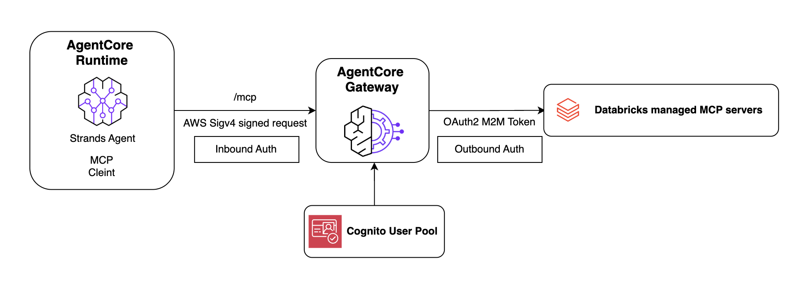

# Databricks SQL MCP Server with Amazon Bedrock AgentCore Gateway

Connect your Databricks SQL MCP server to AgentCore Gateway. Zero custom code — Gateway handles both inbound and outbound auth.

## Overview

This sample demonstrates how to use [Amazon Bedrock AgentCore Gateway](https://docs.aws.amazon.com/bedrock-agentcore/latest/devguide/gateway.html) to expose [Databricks managed MCP servers](https://docs.databricks.com/en/generative-ai/mcp/managed-mcp.html) as tools for AI agents. The gateway manages:

- **Inbound auth** — Amazon Cognito validates agent requests
- **Outbound auth** — AgentCore Identity handles Databricks OAuth2 M2M credentials

The notebook walks you through two deployment paths:
- **Local testing** — Run a Strands Agent locally to verify the gateway integration
- **AgentCore Runtime** — Deploy the agent to a secure, serverless runtime for production use

## Prerequisites

1. AWS credentials configured (`aws configure`) with permissions to create AgentCore resources, IAM roles, and Cognito user pools
2. Databricks workspace with Unity Catalog enabled
3. Databricks service principal with an OAuth secret ([docs](https://docs.databricks.com/en/dev-tools/auth/oauth-m2m.html))
4. Python 3.10+

## Getting Started

The notebook covers:

1. Configure Databricks credentials
2. Create a new AgentCore Gateway **or** reuse an existing one from `gateway_config.json`
3. Set up an OAuth2 credential provider for Databricks outbound auth
4. Add the Databricks DBSQL MCP server as a gateway target
5. Test locally with a Strands Agent
6. Deploy the agent to AgentCore Runtime and invoke it

## Resources

- [Databricks managed MCP servers](https://docs.databricks.com/en/generative-ai/mcp/managed-mcp.html)
- [Databricks OAuth M2M authentication](https://docs.databricks.com/en/dev-tools/auth/oauth-m2m.html)
- [Amazon Bedrock AgentCore Gateway](https://docs.aws.amazon.com/bedrock-agentcore/latest/devguide/gateway.html)
- [Amazon Bedrock AgentCore Runtime](https://docs.aws.amazon.com/bedrock-agentcore/latest/devguide/runtime.html)
- [AgentCore Gateway tutorials](https://github.com/awslabs/amazon-bedrock-agentcore-samples/tree/main/01-tutorials/02-AgentCore-gateway)
- [Strands Agents — Deploy to AgentCore](https://strandsagents.com/latest/documentation/docs/user-guide/deploy/deploy_to_bedrock_agentcore/python/)
